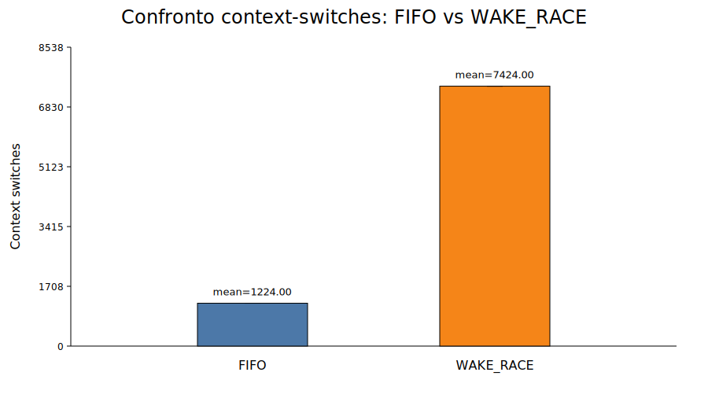
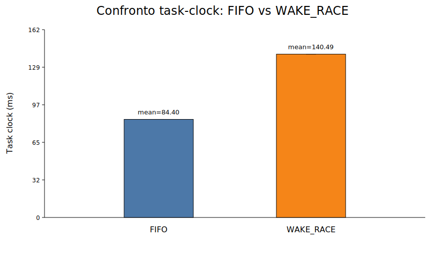

# Syscall Throttling — Linux Kernel Module

A Linux Kernel Module that implements a **syscall rate-limiting mechanism**. An administrator (root) can register program names, user-IDs and syscall numbers, then impose a maximum of `MAX` invocations per second. Threads that exceed the limit are suspended until the next epoch begins with fresh budget. Two scheduling policies are available: **FIFO** (ordered queue) and **WAKE&RACE** (competitive token grab).

---

## Table of Contents

- [Architecture Overview](#architecture-overview)
- [Data Structures](#data-structures)
  - [scth\_state — Global Module State](#scth_state--global-module-state)
  - [scth\_cfg\_store — Configuration Snapshot](#scth_cfg_store--configuration-snapshot)
  - [scth\_waiter — Suspended Thread](#scth_waiter--suspended-thread)
- [Module Lifecycle: scth\_main.c](#module-lifecycle-scth_mainc)
  - [Initialization: scth\_init](#initialization-scth_init)
  - [Shutdown: scth\_exit](#shutdown-scth_exit)
  - [Epoch Timer: scth\_epoch\_timer\_fn](#epoch-timer-scth_epoch_timer_fn)
  - [Monitor On / Off](#monitor-on--off)
- [Syscall Table Hooking: scth\_hook.c](#syscall-table-hooking-scth_hookc)
  - [Accessing the Syscall Table](#accessing-the-syscall-table)
  - [Disabling Write Protection](#disabling-write-protection)
  - [Installing and Removing Hooks](#installing-and-removing-hooks)
  - [Configuration Match: scth\_match\_registered](#configuration-match-scth_match_registered)
  - [The Wrapper: scth\_syscall\_wrapper](#the-wrapper-scth_syscall_wrapper)
  - [FIFO Path](#fifo-path)
  - [WAKE\&RACE Path](#wake&race-path)
- [Policy Transitions](#policy-transitions)
  - [FIFO → WAKE\&RACE](#fifo--wake&race)
  - [WAKE\&RACE → FIFO](#wake&race--fifo)
- [Configuration Database: scth\_cfg.c](#configuration-database-scth_cfgc)
  - [Copy-on-Write with RCU](#copy-on-write-with-rcu)
  - [Lookup Structures](#lookup-structures)
  - [ADD\_SYS and DEL\_SYS Ordering](#add_sys-and-del_sys-ordering)
- [Device Driver: scth\_dev.c](#device-driver-scth_devc)
- [IOCTL Dispatcher: scth\_ioctl.c](#ioctl-dispatcher-scth_ioctlc)
- [Signal Handling and Interruptions](#signal-handling-and-interruptions)
- [User-Space Tool: scthctl](#user-space-tool-scthctl)
- [Building & Loading](#building--loading)
- [Test Suite](#test-suite)

---

## Architecture Overview

```
User space           Kernel space
─────────────────    ─────────────────────────────────────────────
scthctl (CLI)   ──── /dev/scthrottle ──── ioctl dispatcher
                                               │
                                              cfg
                                          prog_ht / uid_ht / sys_bitmap
                                               │
                          syscall table[nr] ──►  scth_syscall_wrapper
                                                     │
                                          ┌──────────┴──────────┐
                                         FIFO               WAKE&RACE
                                     (ordered queue)       (token race)
                                          │                     │
                                          └──── epoch timer ────┘
                                            (jiffies + HZ ≈ 1 s)
```

The module is split into three separated layers:

**Configuration layer** (`scth_cfg.c`): maintains a read-copy-update (RCU) database of registered subjects (program names, user-IDs) and monitored syscall numbers. Every modification produces a new atomic snapshot published via `rcu_assign_pointer`, while old versions are released safely with `call_rcu`.

**Interception layer** (`scth_hook.c`): installs and removes wrappers in the kernel's syscall table, replacing original function pointers with `scth_syscall_wrapper`. When an intercepted syscall is invoked, the wrapper decides in real-time whether to let it through immediately, enqueue it, or bypass entirely based on the current monitor state.

**Control layer** (`scth_main.c`, `scth_ioctl.c`, `scth_dev.c`): exposes a character device `/dev/scthrottle` through which root can configure the module via `ioctl`. A kernel timer fires every second, constituting the system's epoch heartbeat.

### Source Tree

```
kernel/
├── include/scth_internal.h   # Internal structs & prototypes
├── src/
│   ├── scth_main.c           # init/exit, epoch timer, monitor on/off
│   ├── scth_hook.c           # syscall table patching + wrapper logic
│   ├── scth_ioctl.c          # ioctl dispatcher + root access control
│   ├── scth_cfg.c            # prog/uid/sys RCU database
│   └── scth_dev.c            # miscdevice registration (/dev/scthrottle)
include/
└── scth_ioctl.h              # Shared kernel↔user ABI
user/
└── scthctl.c / scthctl_cmds.c  # CLI management tool
tests/
└── t01_*.c … t15_*.c         # Functional & stress tests
external/
└── Linux-sys_call_table-discoverer-master/  # USCTM: finds sys_call_table at runtime
```

---

## Data Structures

### `scth_state` — Global Module State

Defined in `scth_internal.h`, `struct scth_state g_scth` is the single global structure that holds the entire runtime state of the module. It is accessible from all source files via the external variable `g_scth`. Its fields are grouped by concern:

**Synchronization and epoch control:**

- `spinlock_t lock` — the main spinlock protecting epoch fields, the FIFO queue, peak statistics, and blocked thread counters. Always acquired with `spin_lock_irqsave` to be safe even in interrupt context (the timer callback runs in a softirq).
- `bool monitor_on` — flag indicating whether throttling is active. If `false`, all wrappers bypass immediately to the original syscall.
- `__u32 max_active` / `__u32 max_pending` — respectively the current invocation budget per epoch and the value configured via `setmax` that has not yet taken effect if the monitor is running.
- `__u8 policy_active` / `__u8 policy_pending` — active and pending scheduling policy. Possible values: `SCTH_POLICY_FIFO_STRICT` (0) and `SCTH_POLICY_WAKE_RACE` (1).
- `__u64 epoch_id` — monotonically increasing counter that identifies the current epoch. Incremented on every timer tick.
- `__u32 epoch_used` — number of slots already consumed in the current epoch by the FIFO policy.
- `struct timer_list epoch_timer` — kernel timer that fires every `HZ` jiffies (~1 real second).

**WAKE_RACE policy:**

- `atomic_t epoch_tokens` — number of available tokens for the current epoch under WAKE_RACE. Threads compete with `atomic_cmpxchg` to decrement it.
- `wait_queue_head_t epoch_wq` — global wait queue where WAKE_RACE threads sleep waiting for `epoch_id` to change or for tokens to become available.

**FIFO_STRICT policy:**

- `struct list_head fifo_q` — doubly-linked list constituting the FIFO queue, ordered by ticket. Each waiting thread inserts a `scth_waiter` node into this list.
- `__u32 fifo_qlen` — current FIFO queue length (for statistics and peak tracking).
- `atomic64_t fifo_seq` — atomic counter that generates progressive, unique tickets for each thread that enqueues.

**Unload coordination:**

- `bool stopping` — raised when the module is about to be unloaded. The wrapper checks this flag and bypasses throttling, allowing suspended threads to resume and exit the module code cleanly.
- `atomic_t active_wrappers` — counts how many threads are currently executing inside wrapper code. During unload, the module waits on `unload_wq` for this counter to reach zero before freeing memory.
- `wait_queue_head_t unload_wq` — wait queue on which the unload thread sleeps.

**RCU-protected configuration:**

- `struct mutex cfg_mutex` — mutex that serializes writes to the configuration (add/del prog, uid, sys). Reads happen locklessly via RCU.
- `struct scth_cfg_store __rcu *cfg` — RCU pointer to the current configuration snapshot.

**Statistics:** several fields track performance metrics: `peak_delay_ns` (maximum observed delay in nanoseconds), `peak_comm` and `peak_euid` (program and user responsible for the peak), `peak_blocked_threads` (peak number of simultaneously blocked threads), `blocked_sum_samples` and `blocked_num_samples` (for computing the average blocked threads, sampled at each epoch). Atomic counters `total_tracked`, `total_immediate`, `total_delayed`, `total_aborted` track respectively the matched syscalls, those that passed immediately, those that were delayed, and those interrupted.

### `scth_cfg_store` — Configuration Snapshot

Represents an immutable snapshot of the active configuration:

- `prog_ht[256]` — hash table with 256 buckets for program names. Each entry is a `scth_prog_ent` containing a `comm[16]` (task name, as in `task->comm`). The hash function is `jhash` over the full 16 fixed bytes.
- `uid_ht[256]` — hash table with 256 buckets for effective user-IDs. Each entry is a `scth_uid_ent` with an `euid` field. The hash is `hash_32`.
- `sys_bitmap[BITS_TO_LONGS(NR_syscalls)]` — a bitmap of `NR_syscalls` bits where bit `nr` is set if syscall number `nr` is monitored.
- `prog_count`, `uid_count`, `sys_count` — counters for listing and statistics.

The combination of hash tables and bitmap guarantees amortized O(1) lookups for both subject matching and syscall checking.

### `scth_waiter` — Suspended Thread

Stack-allocated inside the wrapper when a thread must wait. Inserted into `fifo_q` while sleeping.

- `struct list_head node` — list node for insertion into `fifo_q`.
- `wait_queue_head_t wq` — private per-thread wait queue. Each waiter has its own to allow selective wake-ups.
- `bool granted` — set to `true` by the epoch timer callback when the thread is promoted (FIFO).
- `bool aborted` — set to `true` when the monitor is turned off or the module is unloaded.
- `__u64 ticket` — ticket number assigned at enqueue time. Maintains FIFO ordering and is used for WAKE_RACE → FIFO migration.

---

## Module Lifecycle: `scth_main.c`

### Initialization: `scth_init`

The `__init` function `scth_init` is the module entry point. It executes the following steps in order:

1. Zeroes the entire `g_scth` structure with `memset`.
2. Initializes all synchronization primitives: `spin_lock_init`, `mutex_init`, `init_waitqueue_head` for both `epoch_wq` and `unload_wq`.
3. Initializes atomic counters and the FIFO queue.
4. Allocates the first empty `scth_cfg_store` with `scth_cfg_alloc_empty(GFP_KERNEL)` and publishes it via `rcu_assign_pointer`. Returns `-ENOMEM` on failure.
5. Sets default values: `monitor_on = false`, `max_pending = 5`, `policy_pending = FIFO_STRICT`.
6. Configures the timer with `timer_setup(&g_scth.epoch_timer, scth_epoch_timer_fn, 0)`. The timer is not armed here, it's armed only when the monitor is switched on.
7. Reads the `sys_call_table_addr` module parameter, provided by the external USCTM module (in `external/`), which dynamically discovers the syscall table address using memory scanning techniques.
8. Calls `scth_dev_init()` to register the miscdevice.

The dependency on USCTM is reflected in `scripts/load_all.sh`, which loads USCTM first, extracts the address from its interface, and passes it as a parameter to `scthrottle`.

### Shutdown: `scth_exit`

The `__exit` function performs a careful, ordered shutdown to avoid use-after-free bugs and hangs:

1. `WRITE_ONCE(g_scth.stopping, true)` — signals all wrappers in execution that the module is exiting.
2. `scth_monitor_off()` — forces the monitor off, draining queues and waking all waiters with `aborted = true`.
3. `scth_hook_remove_all()` — restores all original function pointers in the syscall table.
4. `wait_event(g_scth.unload_wq, atomic_read(&g_scth.active_wrappers) == 0)` — waits for all threads currently inside wrapper code to finish. This is fundamental: without this step, wrapper code could execute after the module has been unloaded from memory, causing a kernel panic.
5. Frees the current `cfg`: first `synchronize_rcu()` to wait for all RCU readers to finish, then `scth_cfg_destroy`.
6. `rcu_barrier()` — ensures all pending `call_rcu` callbacks  complete before the module is removed. Without this, a callback could fire after the module's memory is freed.
7. `scth_dev_exit()` — deregisters the miscdevice.

### Epoch Timer: `scth_epoch_timer_fn`

This function is the heartbeat of the throttling system. It runs in softirq context approximately every second. Under `spin_lock_irqsave` it atomically performs:

- Increments `epoch_id` and resets `epoch_used` — officially begins the new epoch.
- Applies `max_pending → max_active` and `policy_pending → policy_active`. Configuration changes only take effect at the epoch boundary, never mid-epoch, to ensure each epoch runs with a consistent configuration.
- Samples `current_blocked_threads` for average computation (`blocked_sum_samples++`, `blocked_num_samples++`).
- **WAKE&RACE → FIFO transition detection:** if the just-applied policy switched from WAKE_RACE to FIFO_STRICT, sets `wake_epoch_waiters = true` to wake threads sleeping on `epoch_wq` so they can self-migrate into the FIFO queue.
- **Queue management:** if there are waiters in queues in a FIFO policy, promotes them up to `max_active`. Each promoted waiter is removed from the list and added to a local `to_wake` list, then woken outside the lock with `wake_up(&w->wq)`.
- Re-arms itself with `mod_timer(&g_scth.epoch_timer, jiffies + HZ)`.

Wake-ups always happen **after** releasing the spinlock. This is necessary because wait queue internals may acquire their own locks, which would be incompatible with holding the module spinlock in a softirq context and could cause deadlocks.

> **Note on jiffies precision:** the software clock can drift a few milliseconds per tick. An epoch may last ~1.003 s or ~1.007 s. At HZ=100 this accumulates to ~1 s of drift per 100 real seconds; at HZ=1000 it is ~1 s per 1000 s. This is acceptable for a rate-limiting use case.

### Monitor On / Off

`scth_monitor_on()` activates throttling: under the spinlock it sets `monitor_on = true`, applies pending values immediately, and arms the timer. If the policy is WAKE_RACE, it loads the initial token count right away. Threads that arrive before the first timer tick and see an empty queue will be let through immediately or compete for initial tokens.

`scth_monitor_off()` deactivates throttling: under the spinlock it clears `monitor_on`, empties the FIFO queue marking all waiters as `aborted`, then wakes every sleeper. Finally it removes the timer synchronously with `timer_delete_sync`, ensuring the callback will not fire again after the function returns.

---

## Syscall Table Hooking: `scth_hook.c`

### Accessing the Syscall Table

`scth_syscall_table()` returns a pointer to the syscall table as an array of `scth_sys_fn_t` function pointers. The address is read from `g_scth.sys_call_table_addr`, provided at module load time by the USCTM companion module.

### Disabling Write Protection

The kernel's syscall table resides in read-only mapped memory. Writing to it requires temporarily disabling hardware write protection mechanisms.

### Installing and Removing Hooks

`scth_hook_install(nr)` replaces `syscall_table[nr]` with `scth_syscall_wrapper` and saves the original pointer in `scth_orig[nr]`. `scth_hook_remove(nr)` reverses the operation. `scth_hook_remove_all()` iterates over all syscall numbers and removes every active hook.

The `scth_hooked[nr]` flag allows detecting double-installation attempts, returning `-EEXIST` in that case.

### Configuration Match: `scth_match_registered`

Before applying throttling, the wrapper must verify whether the syscall invoked by the current thread is subject to throttling mechanism. `scth_match_registered` performs this check under RCU read protection:

```
syscall nr is registered  AND  (program name is registered  OR  euid is registered)
```

The RCU access (`rcu_read_lock` / `rcu_dereference` / `rcu_read_unlock`) guarantees the configuration snapshot will not be freed while in use, without requiring any exclusive lock. This is fundamental for performance: every intercepted syscall executes this check on its critical path.

### The Wrapper: `scth_syscall_wrapper`

This function is the interception core. All installed hooks point to this single function, which identifies the syscall via `regs->orig_ax` (the RAX register at syscall entry on x86-64) and applies throttling logic. The general flow is:

1. **Wrapper entry:** `scth_wrapper_enter()` increments `active_wrappers`.
2. **Immediate bypass:** if `stopping` or `!monitor_on`, calls `orig(regs)` directly.
3. **Identity read:** `get_task_comm(comm, current)` and `from_kuid(&init_user_ns, current_euid())` read the current process name and UID.
4. **Match check:** if the thread does not match the configuration, bypasses.
5. **Tracking:** `scth_stat_tracked()` increments the "tracked syscall" counter.
6. **Policy branch:** reads `policy_active` and branches into WAKE_RACE or FIFO_STRICT.
7. **Wrapper exit:** `scth_wrapper_exit()` decrements `active_wrappers` and, if in unload phase, notifies `unload_wq`.

### FIFO Path

The FIFO path guarantees strict first-in/first-out ordering for access to epoch slots. Under the spinlock, it checks: if the queue is empty **and** `epoch_used < max_active`, the thread passes immediately by incrementing `epoch_used`. Otherwise, even if slots remain but the queue is non-empty, the thread enqueues to respect FIFO ordering. A `scth_waiter` is created on the stack with a ticket assigned by `atomic64_inc_return(&g_scth.fifo_seq)`.

The waiter is inserted in ascending ticket order into `fifo_q` via `scth_fifo_enqueue_waiter_locked`. The thread then suspends on `wait_event_interruptible(w.wq, ...)` with the wake condition: `w.granted || w.aborted || !monitor_on || stopping`.

On wake-up, three cases are handled:
- **Unix signal** (`ret < 0`): if still enqueued (not yet granted), removes itself from the queue and decrements `fifo_qlen`, increments `total_aborted`, returns `-EINTR`.
- **Abort/stopping**: bypasses directly to the original syscall (`total_aborted`).
- **Granted**: measures elapsed time from `t0 = ktime_get_ns()`, updates delay statistics, then executes the original syscall.

The decision to enqueue even when slots are available but the queue is non-empty prevents starvation of already-waiting threads: a late-arriving thread can never skip ahead of one already in the queue.

```
Thread arrives
    │
    ▼
fifo_qlen == 0  AND  epoch_used < max_active?
    ├── YES ──► epoch_used++  →  execute immediately  
    └── NO  ──► ticket = atomic64_inc(fifo_seq)
                insert waiter into fifo_q (sorted by ticket)
                blocked_inc()
                sleep on w.wq  (interruptible)
                    │
                    ▼  (woken by epoch timer)
                granted?  ──► measure delay  →  execute
                aborted?  ──► stat_aborted   →  execute (monitor off)
                signal?   ──► remove from queue  →  return -EINTR
```

### WAKE&RACE Path

The WAKE_RACE path implements a competitive race for per-epoch tokens. First it attempts `scth_try_take_token()`: reads `epoch_tokens` with `atomic_read`, and if positive, uses `atomic_cmpxchg` to decrement it. If the CAS succeeds, the thread has obtained a token and executes immediately. If no tokens are available, the thread increments the blocked counter, assigns itself a ticket (useful for potential migration), and suspends on `wait_event_interruptible(epoch_wq, ...)` with a wake condition that also includes a policy change.

On wake-up:
- If the policy has become FIFO_STRICT, the thread **self-migrates** into `fifo_q`, inserting a `scth_waiter` with its original ticket (preserving arrival order).
- If still WAKE_RACE and the epoch has changed, retries the CAS.
- If `stopping` or `!monitor_on`, executes the original syscall (abort).
- On Unix signal, returns `-EINTR`.

```
Thread arrives
    │
    ▼
atomic_cmpxchg(epoch_tokens, v, v-1) succeeds?
    ├── YES ──► execute immediately
    └── NO  ──► ticket = atomic64_inc(fifo_seq for possible migration)
                blocked_inc()
                sleep on epoch_wq  (interruptible)
                    │
                    ▼  (woken by epoch timer)
                policy → FIFO?    ──► self-insert into fifo_q with original ticket
                epoch changed?    ──► retry cmpxchg
                stopping/off?     ──► execute (unblocked)
                signal?           ──► return -EINTR
```

---

## Policy Transitions

Policy transitions are one of the most delicate aspects of the module. The system uses a "pending" mechanism: the new policy is written to `policy_pending` and only becomes effective at the start of the next epoch, never mid-epoch, to ensure a full epoch runs with a consistent configuration.

### FIFO → WAKE&RACE

At the timer tick, the callback applies `policy_active = WAKE&RACE`. From this moment, the wrapper's branch will take the WAKE&RACE path for new arrivals. Threads already in the FIFO queue are promoted normally in the current epoch (if slots remain); in subsequent epochs no new FIFO waiters are added. The FIFO queue drains naturally.

### WAKE&RACE → FIFO

This case threads are already sleeping on `epoch_wq`. When the callback applies `policy_active = FIFO`, it sets `wake_epoch_waiters = true`. This wakes all threads sleeping on `epoch_wq`. On wake up, each thread checks the new policy and, finding `FIFO`, self-inserts into `fifo_q` using its original ticket. This preserves arrival order across the policy transition. The thread is already counted as blocked, so no additional `blocked_inc` is issued during migration.

---

## Configuration Database: `scth_cfg.c`

Implements all management operations for the internal database: program names, user-IDs, and registered syscalls.

### Copy-on-Write with RCU

Configuration modifications follow a copy-on-write pattern that ensures wrapper readers are never blocked:

```
mutex_lock(cfg_mutex)
  new_cfg = scth_cfg_clone(current_cfg)   // deep copy: ht entries + bitmap
  modify new_cfg (add or delete)
  rcu_assign_pointer(g_scth.cfg, new_cfg) // publish atomically
  scth_cfg_retire(old_cfg)                // call_rcu → free after all readers finish
mutex_unlock(cfg_mutex)
```

`call_rcu` guarantees `scth_cfg_destroy` is only called after all RCU readers currently using the old snapshot have completed their read-side critical section. Readers in the wrapper use `rcu_read_lock` / `rcu_dereference` / `rcu_read_unlock`, they are **never blocked**.

### Lookup Structures

**Program names** are stored in `prog_ht`, a hash table with 256 buckets. The key is `jhash(comm, 16, 0)`. Search, insertion, and deletion scan the corresponding bucket with `hlist_for_each_entry`. Comparison is `memcmp` over the full 16 bytes.

**User-IDs** are stored in `uid_ht`, also 256 buckets. The key is `hash_32(euid, 8)`. Logic is identical to program names.

**Syscall numbers** are stored as a bitmap of `NR_syscalls` bits.

### ADD_SYS and DEL_SYS Ordering

Adding a syscall to monitoring also requires installing a hook on the syscall table. The ordering of operations is critical for correctness:

- **ADD_SYS**: install the hook first (via `scth_hook_install`) → then publish the new snapshot with the updated bitmap. In the transient window (hook installed but bitmap not yet visible via RCU), the wrapper's match check fails for that syscall and it bypasses. Only after the new bitmap is published does throttling begin.
- **DEL_SYS**: publish the new snapshot without the syscall first (the wrapper begins bypassing immediately) → then remove the hook. If hook removal fails, rollback by re-publishing the old snapshot via `call_rcu`, it cannot be immediately destroyed because it may have already been seen by RCU readers.

---

## Device Driver: `scth_dev.c`

The module uses the kernel's `miscdevice` API to register as a character device. `misc_register` automatically allocates a dynamic minor number and creates `/dev/scthrottle`. The mode `0666` allows any user to open the device, but privileged operations are filtered at the ioctl level by checking `current_euid()`.

---

## IOCTL Dispatcher: `scth_ioctl.c`

`scth_ioctl_dispatch` is the central switch that handles all commands. Root access control is implemented by `scth_is_root()`, which compares `current_euid()` against `GLOBAL_ROOT_UID`. Any modifying operation (ON, OFF, SET_MAX, SET_POLICY, RESET_STATS, ADD/DEL prog/uid/sys) requires root. Read operations (GET_CFG, GET_STATS, GET_*_COUNT, GET_*_LIST) are accessible to all users.

Operations on monitor parameters (`SET_MAX`, `SET_POLICY`) modify `max_pending` and `policy_pending` under the spinlock. They do not modify the active values directly: the transition happens at start of next epoch. This guarantees that a full epoch runs with a coherent configuration.

### Command Reference

| Command | Dir | Requires root | Description |
|---|---|---|---|
| `SCTH_IOC_ON` | — | ✓ | Enable monitor |
| `SCTH_IOC_OFF` | — | ✓ | Disable monitor, unblock all waiters |
| `SCTH_IOC_SET_MAX` | W `u32` | ✓ | Set max invocations/epoch (pending, applied next epoch) |
| `SCTH_IOC_SET_POLICY` | W `u8` | ✓ | Set policy: 0=FIFO_STRICT, 1=WAKE_RACE (pending) |
| `SCTH_IOC_RESET_STATS` | — | ✓ | Reset all statistics |
| `SCTH_IOC_GET_CFG` | R `scth_cfg` | — | Read current config snapshot |
| `SCTH_IOC_GET_STATS` | R `scth_stats` | — | Read all statistics |
| `SCTH_IOC_ADD_PROG` / `DEL_PROG` | W `scth_prog_arg` | ✓ | Register/unregister program name |
| `SCTH_IOC_ADD_UID` / `DEL_UID` | W `scth_uid_arg` | ✓ | Register/unregister euid |
| `SCTH_IOC_ADD_SYS` / `DEL_SYS` | W `scth_sys_arg` | ✓ | Register/unregister syscall number |
| `SCTH_IOC_GET_PROG/UID/SYS_LIST` | RW `scth_list_req` | — | Enumerate registered entries |

---

## Signal Handling and Interruptions

Both queues (`fifo_q` and `epoch_wq`) use `wait_event_interruptible`, which allows threads to be woken by Unix signals. When a signal arrives (`ret < 0` from `wait_event_interruptible`), the wrapper handles the situation safely:

- If the thread is still in the FIFO queue (not yet removed by the timer), it acquires the spinlock and explicitly removes itself, decrementing `fifo_qlen`.
- Increments `total_aborted`.
- Returns `-EINTR` to the syscall, per POSIX convention.

This means that sending `SIGINT` to a throttled process will correctly interrupt its wait and surface as `EINTR`, just as with any other blocking syscall.

---

## User-Space Tool: `scthctl`

The command-line tool `user/scthctl` provides a convenient interface for all ioctl operations. It opens `/dev/scthrottle`, translates command-line arguments into ioctl calls, and prints results.

```
Usage:
  scthctl on | off
  scthctl setmax <max_per_sec>
  scthctl setpolicy <0|1>       (0=FIFO_STRICT, 1=WAKE_RACE)
  scthctl resetstats
  scthctl status
  scthctl stats
  scthctl addprog <comm> | delprog <comm> | listprog
  scthctl adduid  <euid> | deluid  <euid> | listuid
  scthctl addsys  <nr>   | delsys  <nr>   | listsys
```

### Quick Example

```bash
# Register uname (syscall 63) for all processes running as UID 1000
sudo scthctl addsys 63
sudo scthctl adduid 1000
sudo scthctl setmax 5          
sudo scthctl on

# Check state
scthctl status
scthctl stats

# Turn off
sudo scthctl off
```

---

## Building & Loading

### Prerequisites

- Linux kernel headers for the running kernel
- The [USCTM module](external/Linux-sys_call_table-discoverer-master/) to discover the `sys_call_table` address at runtime

### Build

```bash
# Build USCTM
cd external/Linux-sys_call_table-discoverer-master && make

# Build the main module
cd kernel && make

# Build the user-space tool
cd user && make

# Build tests
cd tests && make
```

### Load / Unload

The convenience scripts handle load order and address passing automatically:

```bash
sudo ./scripts/load_all.sh
sudo ./scripts/unload_all.sh
```

---

## Test Suite

```bash
cd tests && sudo ./run_all.sh
```

| Test | What it verifies |
|---|---|
| `t01_no_match` | Unregistered syscalls are never throttled |
| `t02_immediate_only` | Threads pass immediately when budget is not exhausted |
| `t03_fifo_burst` | Concurrent threads are correctly rate-limited under FIFO_STRICT |
| `t04_wakerace_burst` | Concurrent threads are correctly rate-limited under WAKE_RACE |
| `t05_abort_off` | `monitor_off` correctly unblocks all waiting threads |
| `t06_dynamic_setmax` | Changing MAX while monitor is running takes effect at next epoch |
| `t07_multisyscall` | Multiple registered syscalls are tracked independently |
| `t08_permissions` | Privileged operations are denied to non-root users |
| `t09_dup_config` | Duplicate registrations return `-EEXIST` |
| `t10_policy_transition` | FIFO ↔ WAKE_RACE transitions work correctly with active waiters |
| `t11_nonroot_uid_match` | Non-root UIDs are correctly matched and throttled |
| `t12_root_uid_nomatch` | Root bypasses throttling unless explicitly registered |
| `t13_setmax_invalid` | `MAX=0` is correctly rejected |
| `t14_unload_during_wait` | Safe `rmmod` while threads are sleeping in the queue |
| `t15_wakerace_to_fifo` | WAKE_RACE → FIFO migration preserves arrival order via ticket |

---
## Performance Comparison: FIFO vs WAKE&RACE

The benchmark (`tests/bench_uname.c`) measures the two policies under heavy
concurrent load: **300 threads** each invoking a registered syscall (`uname`,
nr 63) **3 times**, with only **20 execution slots per epoch** available.

### Context Switches



| Policy | Context switches |
|---|---|
| FIFO_STRICT | 1224 |
| WAKE_RACE | 7424 |

WAKE&RACE produces **~6× more context switches** than FIFO. The
explanation is structural. In FIFO_STRICT the epoch timer promotes at most
`max_active` (20) waiters per tick: it calls `wake_up` on each of their private
queues individually, so exactly 20 threads are rescheduled per epoch, no more.
Every other thread stays parked on its own and is never touched by the
scheduler until its turn comes.

In WAKE_RACE the timer fires a single `wake_up_all` on the shared `epoch_wq`,
waking **all 280 still-sleeping threads simultaneously**. Each of them is
context-switched in, attempts `atomic_cmpxchg` to grab a token, and, since
only 20 tokens exist, 260 of them fail and immediately go back to sleep,
generating another context switch out. This broadcast-and-race cycle repeats
every epoch, making the total context switch count explode relative to the
number of actually granted slots.

### Task Clock



| Policy | Task clock |
|---|---|
| FIFO_STRICT | 84.399 ms |
| WAKE_RACE | 140.490 ms |

WAKE&RACE consumes **~66% more CPU time** than FIFO. This is the direct
cost of the CAS race: after the broadcast wake-up, every woken thread runs
`scth_try_take_token()`
until it either wins a token or confirms none are left. With 280 threads woken
and only 20 tokens available, 260 threads burn CPU on a losing race every epoch.
FIFO avoids this entirely: a thread that misses the IMM slot sleeps
immediately and is woken exactly once when the timer grants it a slot, never
spinning.

---
